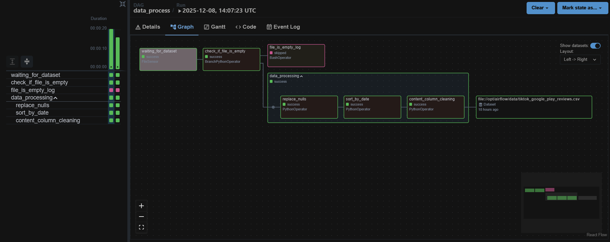
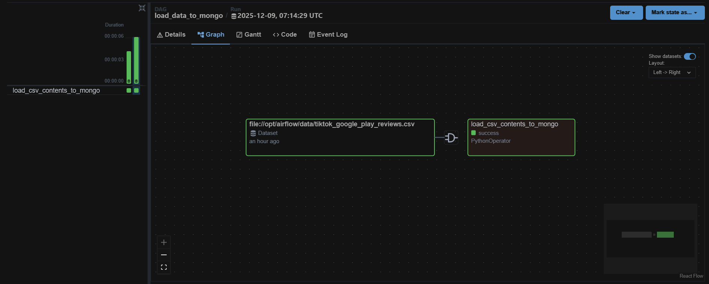

# Airflow ETL Pipeline: CSV to MongoDB

This project implements a local data processing pipeline using **Apache Airflow**, **Docker**, and **MongoDB**. 

## Project Structure
- `dags/` - Python code for DAGs.
- `docker-compose.yaml` - Infrastructure configuration.
- `mongodb_queries.js` - Aggregation queries for analysis.

## Workflow Visualization
Here are the Graph views of the main processing DAGs:




MongoDB Compass query results in .JSON format and their respective screenshots are also included in .mongodb_compass_query_results folder.

## How to Run
1. Clone the repository.
2. Start services:
   ```bash
   docker-compose up -d
