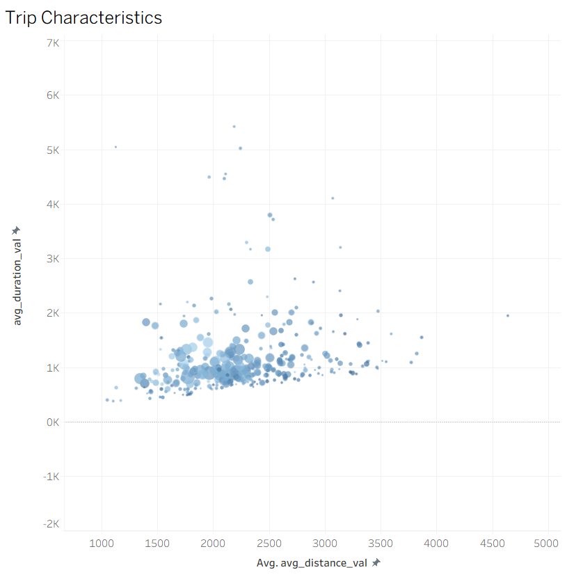
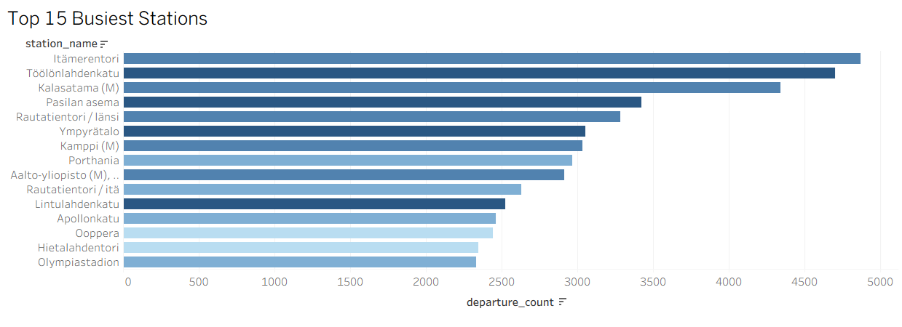

# LMS LocalStack Task - Helsinki City Bike ETL Pipeline

## Project Overview

This project implements an **ETL pipeline** that processes Helsinki City Bike trip data. It simulates a cloud environment locally using **LocalStack** (AWS emulation) and orchestrates data flows using **Apache Airflow**.

The pipeline ingests raw monthly data, processes it using **Apache Spark** to calculate station metrics, triggers event-driven **AWS Lambda** functions via S3/SQS, stores aggregated results in **DynamoDB**. Processed data can be later used to visualize insights in **Tableau**.

## Getting Started

Follow these steps to set up the environment and run the pipeline.

### 0. Clone the repository
Clone this project to your local machine.

### 1. Configuration
This project uses environment variables to configure Docker services. Create a `.env` file in the root directory by copying the example:
   ```bash
   cp .env.example .env
   ```
**(Optional)** Security Setup: The example file contains a public Fernet Key for demonstration purposes. To secure the installation, generate a new unique key:
   ```bash
   python -c "from cryptography.fernet import Fernet; print(Fernet.generate_key().decode())"
   ```
Replace the AIRFLOW_FERNET_KEY value in your new .env file with the output. Verify Settings: Ensure AIRFLOW_UID matches your current user ID (Linux only). For Windows/Mac, the default 50000 is usually fine.

### 2. Prepare the Data
Download the Helsinki City Bike dataset from Kaggle:
[**Helsinki City Bikes Dataset**](https://www.kaggle.com/datasets/geometrein/helsinki-city-bikes)

>**Important:** You must rename the downloaded file to **`bikes.csv`**.

### 3. Place the Data
Move the `bikes.csv` file into the `data/` directory of the project.

### 4. Launch Infrastructure
Start the Docker containers (Airflow, LocalStack, Spark):
```bash
docker-compose up -d --build
```

### 5. Initialization
Wait a few minutes for the containers to fully start and for `init_aws.sh` to configure LocalStack resources (buckets, queues, tables).

### 6. Run the Pipeline
Access the Airflow UI and trigger the DAG.
* **URL:** `http://localhost:8080/`
* **Credentials:** `admin` / `admin`

### 7. Export Data for Visualization
Once the pipeline finishes, you are able to access the output files in the `dags/tableau_data/` directory.

## Visualization Results

The processed data was exported from DynamoDB and visualized using Tableau to identify usage patterns and popular routes.

### 1. Trip Characteristics (Scatter Plot)
*Analysis of duration vs. distance. This reveals clusters of user behavior: short "commuter" trips versus long "leisure" rides.*



### 2. Top 15 Busiest Stations
*A breakdown of the most popular departure stations, color-coded by the average speed of trips starting from there.*



### 3. Station Traffic Share
*A Tree Map visualization showing the relative volume of traffic for each station compared to the total network.*

