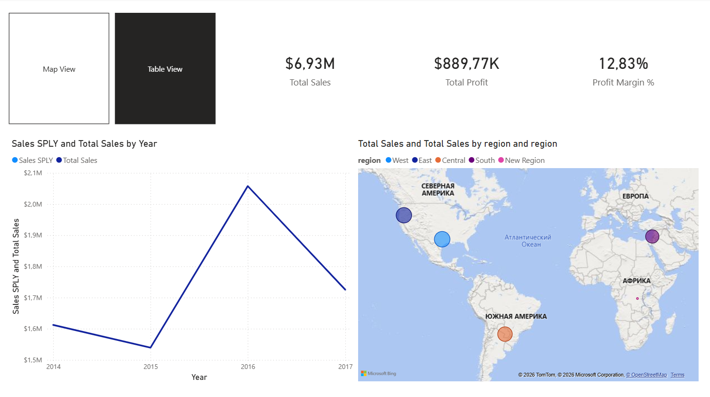
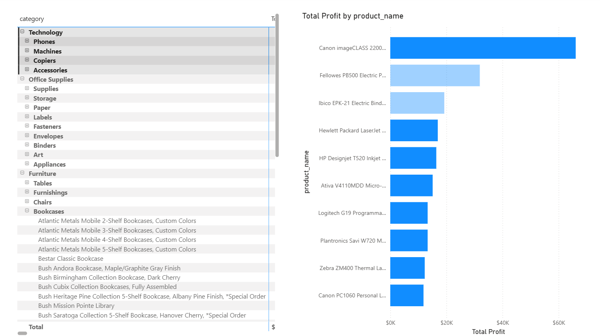
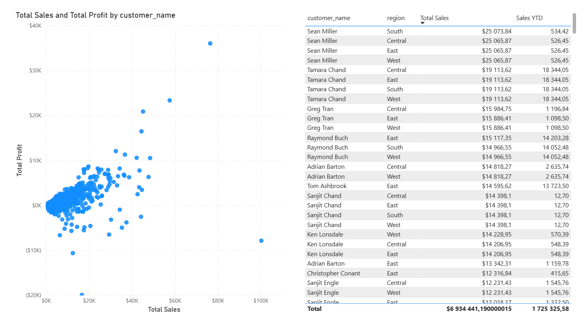

# LMS Power BI task - Automated End-to-End Business Data Pipeline

This project implements a complete End-to-End Data Engineering Pipeline.
The infrastructure is fully containerized. Upon startup, the system automatically provisions the database, applies the schema and executes the initial day 1 data load.

## How to Run

### 1. Prerequisites
You only need **Docker Desktop**. No local installation of Python or PostgreSQL is required.

**Important:** Download the **[Superstore Dataset](https://www.kaggle.com/datasets/vivek468/superstore-dataset-final)** from Kaggle and place the source file `superstore.csv` into the `data/` directory before starting.

### 2. Automatic Start (Day 1)
Build and start the containers with a single command:

```bash
docker-compose up --build
```
**Database is being created and filled with day one data automatically**

### 3. Change Simulation (Day 2)
To verify the SCD Type 2 logic, trigger the "Day 2" load manually:

```bash
docker-compose run --rm etl python etl/orchestrator.py /app/data/secondary_load.csv
```

## Power BI Report

The report file is located at: `power_bi_export_files/power_bi_task_9.pbix`.

### Dashboard Gallery

**1. Sales Overview**
*KPIs, Year-over-Year analysis, and interactive Map/Table toggle.*


**2. Product Performance**
*Drill-down matrix and top profitability analysis.*


**3. Customer Insights**
*Scatter plot analysis (Profit vs Sales) and customer details.*
